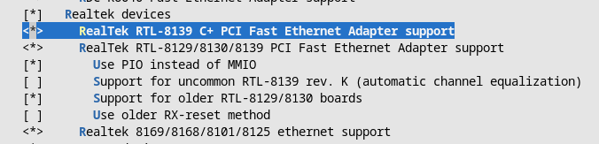

## Buildroot
`make menuconfig` to configure.\
Checked options:
- Target Architecture = x86_64
- Install glibc utilities
- Enable C++ support (apperently needed by iperf3)
- Disable root login and login prompt
- Disable kernel
- Enable iperf3 (Target packages -> Networking applications)
- ext4 root filesystem

Copy init scripts to rootfs (maybe have to do one make before this):
```
cp inittab buildroot/output/target/etc/inittab 
# or just add console::respawn:-/bin/sh to etc/inittab
cp setup_client_net.sh buildroot/output/target/etc/init.d/S41network_qemu
cd buildroot
make
```

## Networking
Create tap between host and client called qemu_tap (no outside connection) on subnet 192.168.111.0/24. The host ip is **192.168.111.1** and the client **192.168.111.2**.

Run `setup_host_net.sh` to setup host network (create tap, assign ip and routing).\
Run `delete_host_net.sh` to remove the host network (remove tap and routing).
The script `setup_client_net.sh` is run during by the init script in qemu on boot which sets up ip and routing on the client

Need to enable this driver in the kernel for `-device rtl8139` to work.


## Linux Kernel
```
cd linux

# Default configuration
make O=../linux-x86-build defconfig
make O=../linux-x86-build kvm_guest.config

# Further configuration
make O=../linux-x86-build menuconfig

# Build
make O=../linux-x86-build -j8 
```